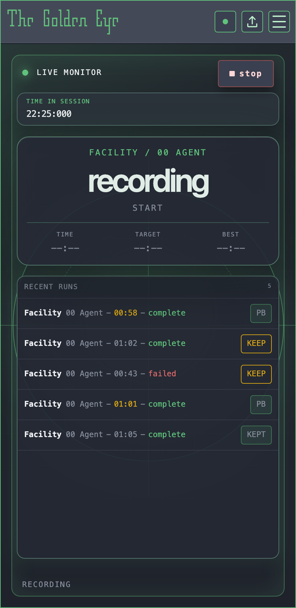
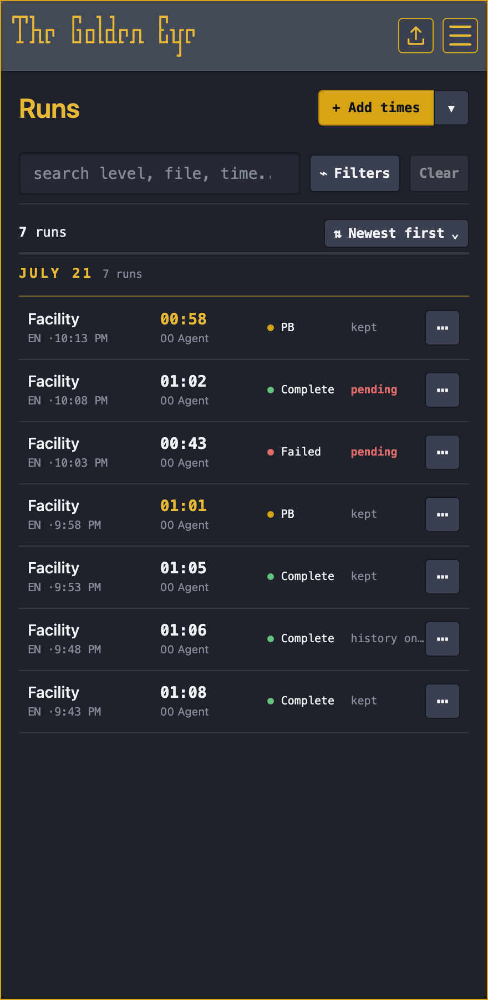
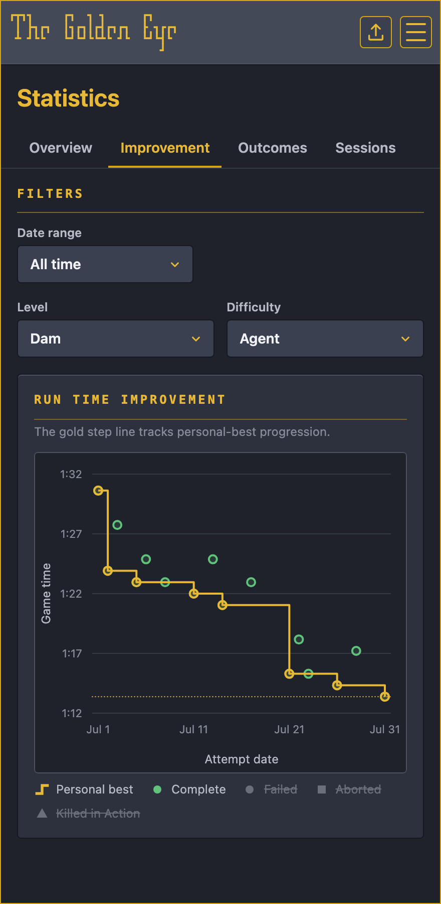
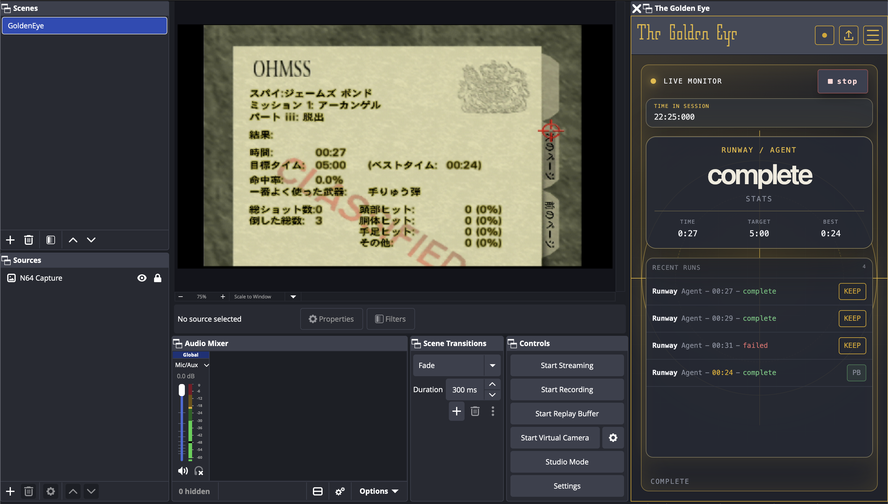

# The Golden Eye

This is a plugin for OBS Studio that assists with GoldenEye N64 speed-running.

- 🎬 Automatically capture runs
- ⭐ Keep your best clips
- 📉 Track your progress
- 📺 One-click (or automatic) YouTube uploads

<table>
  <tr>
    <th width="33%">Automatic recording</th>
    <th width="33%">Run library</th>
    <th width="33%">Progress statistics</th>
  </tr>
  <tr>
    <td align="center" valign="top"></td>
    <td align="center" valign="top"></td>
    <td align="center" valign="top"></td>
  </tr>
  <tr>
    <td colspan="3" align="center"></td>
  </tr>
</table>

... and more!

## OBS compatibility

The recommended minimum OBS Studio version is `31.1.0`, but the plugin should work on OBS `31.0.0`
and later.

## How to install

Follow the instructions for your operating system:

- [Install on Linux](docs/install-linux.md)
- [Install on macOS](docs/install-macos.md)
- [Install on Windows](docs/install-windows.md)

## Updates

The plugin has an auto-update feature! Most of the time it can update itself just fine.

If there's ever a new update that requires the plugin to be manually installed, the plugin will let
you know.

## Troubleshooting

If the plugin misbehaves, [enabling debug logging](docs/debug-logging.md) helps you (and
maintainers) see what's going on.

## Contributing

See [CONTRIBUTING.md](CONTRIBUTING.md) for how to work on this plugin.
