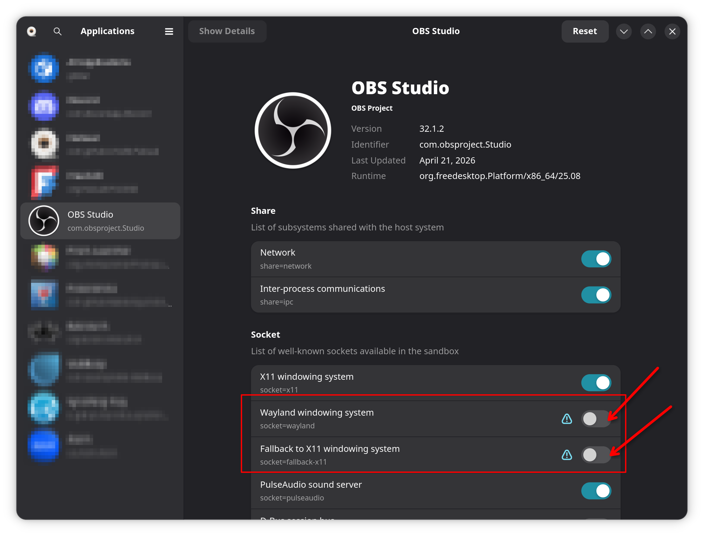

# Installing on Linux

## Requirements

It's recommended that you install and use the flatpak version of OBS Studio, as this is the recommended install method from the OBS developers. The flatpak version also includes the embedded browser which this plugin needs for its UI to work inside of OBS.

If you're using a Wayland window server (if you don't know what this is, you probably are) you also need to make sure that OBS runs in X11 mode. OBS's embedded browser doesn't work in Wayland, so it will disable a bunch of functionality that this plugin also needs.

The easiest way to do this is to install Flatseal and configure OBS like so:



This is also possible via the command line if you're so inclined:

```bash
flatpak run --socket=x11 --nosocket=wayland --nosocket=fallback-x11 com.obsproject.Studio
```

## Installing the plugin

Download the latest release from the [releases page](https://github.com/acheronfail/the_golden_eye/releases) and extract it and copy the `the_golden_eye` folder to your OBS Studio plugins directory.

For the flatpak installation, this is usually: `$HOME/.var/app/com.obsproject.Studio/config/obs-studio/plugins/`

Now open OBS Studio or restart it, and TODO (custom dock screenshot)

## Uninstalling the plugin

To uninstall the plugin, simply delete the `the_golden_eye` folder from your OBS Studio plugins directory. This is usually at `$HOME/.var/app/com.obsproject.Studio/config/obs-studio/plugins/`, and then restart OBS Studio.
