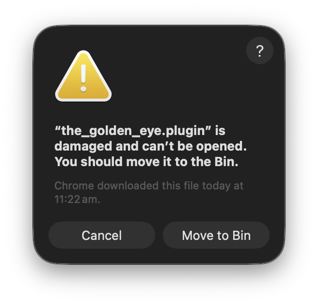

# Installing on macOS

## Requirements

Have OBS installed in `/Applications`.

## Installing the plugin

Download the latest release from the
[releases page](https://github.com/acheronfail/the_golden_eye/releases) and extract it and copy the
`The Golden Eye.plugin` file into your OBS plugins directory.

On macOS, this is found at `$HOME/Library/Application Support/obs-studio/plugins/`:


### Allow it via macOS Gatekeeper

If you're using macOS, be aware that this application isn't notarised: this means that macOS will
block the plugin from loading, and you'll see this warning:



Don't worry though, we can fix this easily, and we only have to do this once (the plugin can still
update). To fix it, you'll need to run the following in Terminal:

```sh
#                              ↓↓↓ make sure this path is where your plugin file is!
#                              ↓↓↓ you can drag and drop the plugin onto Terminal to get the right path
xattr -d com.apple.quarantine "~/Library/Application Support/obs-studio/plugins/the_golden_eye.plugin"
```

### Start up OBS

Now open OBS Studio or restart it, and the plugin should appear as an integrated window. If it
doesn't appear, open the `Docks` menu item and make sure that `The Golden Eye` is checked:


## Uninstalling the plugin

To uninstall the plugin, simply delete the `The Golden Eye.plugin` directory from your OBS Studio
plugins directory. This is usually at `$HOME/Library/Application Support/obs-studio/plugins/`, and
then restart OBS Studio.

Open `Docks` -> `Custom Browser Docks` and remove the entry for `The Golden Eye` if it is still
present.
