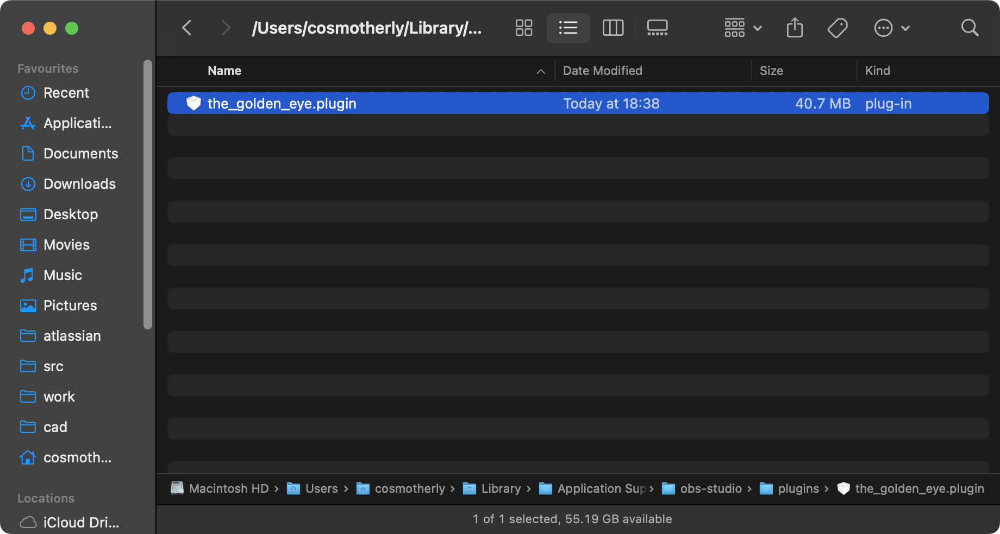
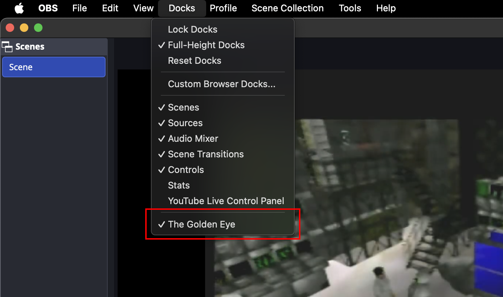

# Installing on macOS

## Requirements

Have OBS installed in `/Applications`.

## Installing the plugin

Official releases are signed with a Developer ID certificate and notarized by
Apple, so macOS Gatekeeper lets them load without any workaround.

Download the latest release from the [releases page](https://github.com/acheronfail/the_golden_eye/releases) and extract it and copy the `The Golden Eye.plugin` file into your OBS plugins directory.

On macOS, this is found at `$HOME/Library/Application Support/obs-studio/plugins/`:

Now open OBS Studio or restart it, and the plugin should appear as an integrated window.
If it doesn't appear, open the `Docks` menu item and make sure that `The Golden Eye` is checked:

## Uninstalling the plugin

To uninstall the plugin, simply delete the `The Golden Eye.plugin` directory from your OBS Studio plugins directory. This is usually at `$HOME/Library/Application Support/obs-studio/plugins/`, and then restart OBS Studio.

Open `Docks` -> `Custom Browser Docks` and remove the entry for `The Golden Eye` if it is still present.
