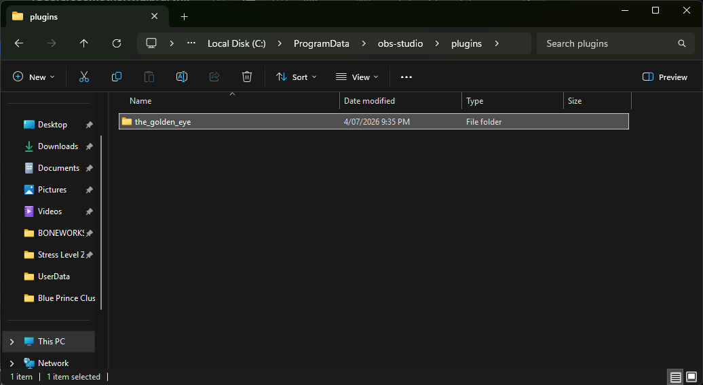
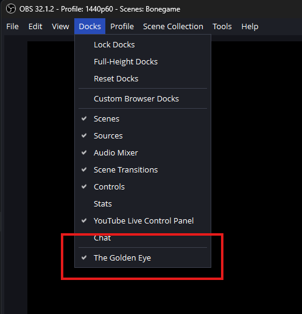

# Installing on Windows

## Requirements

Have OBS Studio installed.

## Installing the plugin

Download the Windows zip from the
[releases page](https://github.com/acheronfail/the_golden_eye/releases) and extract it.

Copy the extracted `the_golden_eye` folder to OBS Studio's recommended Windows plugin directory:

```text
C:\ProgramData\obs-studio\plugins
```



Now open OBS Studio or restart it, and the plugin should appear as an integrated window. If it
doesn't appear, open the `Docks` menu item and make sure that `The Golden Eye` is checked.



## Uninstalling the plugin

Delete this folder and restart OBS Studio:

```text
C:\ProgramData\obs-studio\plugins\the_golden_eye
```

Open `Docks` -> `Custom Browser Docks` and remove the entry for `The Golden Eye` if it is still
present.
